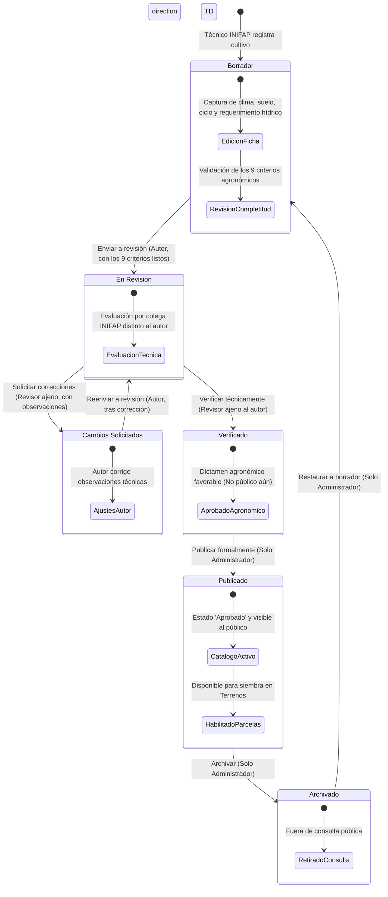

# Flujo de Aprobación y Publicación: Cultivos

Este documento describe el proceso de validación técnica, ciclo de vida editorial y criterios de publicación para el catálogo agronómico de cultivos en **Agrosystem**.

---

## 1. Segregación de Funciones y Control Dual

El módulo de cultivos sigue el esquema de aseguramiento de calidad técnica mediante revisión por pares:

- **INIFAP (Autor / Investigador):** Da de alta la ficha agronómica del cultivo, ingresa requerimientos climáticos, de suelo, hídricos, calendario de siembra y fotografías.
- **INIFAP (Revisor Agrónomo):** Técnico o investigador distinto al autor (`userId !== createdByUserId`). Valida la coherencia de los parámetros fenológicos y agronómicos. Puede aprobar técnicamente o solicitar correcciones.
- **Administrador:** Revisa el expediente verificado y realiza la publicación formal. **Solo los cultivos publicados (`published`) pueden ser seleccionados posteriormente por los productores y técnicos para registrar ciclos de siembra en parcelas y terrenos.**

---

## 2. Diagrama de Estados del Cultivo

---

## 3. Matriz de Estados y Acciones

| Estado Actual | Acción (`action`) | Siguiente Estado | Roles Autorizados | Efectos y Restricciones |
| :--- | :--- | :--- | :--- | :--- |
| `draft` | `submit_review` | `in_review` | INIFAP (Autor) | Valida 9 puntos de preparación técnica. Limpia observaciones previas. |
| `in_review` | `request_changes` | `changes_requested` | INIFAP (Revisor ajeno) | Requiere observaciones explicativas (máximo 500 caracteres). |
| `in_review` | `verify` | `verified` | INIFAP (Revisor ajeno) | Registra `verified_by_user_id` y `verified_at`. No publica de inmediato. |
| `changes_requested` | `submit_review` | `in_review` | INIFAP (Autor) | El autor reenvía a revisión tras actualizar la ficha. |
| `verified` | `publish` | `published` | Administrador | Asigna `status = 'aprobado'`, `published_by_user_id`, `published_at`. Habilita uso en parcelas. |
| `published` | `archive` | `archived` | Administrador | Retira el cultivo de la vista pública. |
| `archived` | `restore` | `draft` | Administrador | Regresa a borrador eliminando sellos de verificación previa para reiniciar ciclo. |

---

## 4. Criterios de Preparación para Publicación (*Readiness Checklist*)

Definidos en [`cropReadinessService.js`](../../src/services/cropReadinessService.js). Para que una ficha de cultivo pueda pasar a revisión (`submit_review`) o ser verificada/publicada, debe cumplir la totalidad de estos 9 puntos:

1. **Identificación taxonómica:** Nombre común y nombre científico (`name`, `scientific_name`).
2. **Clasificación:** Categoría agronómica del cultivo (`category`, ej. Hortaliza, Cereal, Frutal).
3. **Descripción técnica:** Descripción botánica y agronómica completa (`description`).
4. **Región productiva:** Zona geográfica óptima de producción (`region`).
5. **Condiciones climáticas:** Clima o temperatura óptima documentada (`climate` u `optimal_climate`).
6. **Requisitos de suelo:** Tipo de suelo o textura requerida (`soil_type` o `soil_requirements`).
7. **Ciclo agrícola:** Duración estimada y temporada de siembra (`cycle`/`growth_cycle` y `season`/`planting_season`).
8. **Requerimiento hídrico:** Demanda de agua o régimen de riego (`water_requirement`/`water_requirements`).
9. **Evidencia fotográfica:** Al menos 1 fotografía de alta calidad del cultivo (`imageCount >= 1`).

---

## 5. Endpoints y Reglas de Integración

- **Actualizar Estado de Workflow:**
  - `POST /private/crops/:id/workflow`
  - Body: `{ "action": "submit_review" | "request_changes" | "verify" | "publish" | "archive" | "restore", "review_notes": "..." }`
- **Impacto Transversal en Terrenos / Parcelas:**
  - Cuando un usuario intenta registrar un ciclo de cultivo en un terreno (`POST /private/lands/:id/cycles`), el backend valida estrictamente que `workflow_status === 'published'`. Si el cultivo aún está en borrador o verificado pero no publicado, el sistema rechaza la operación con error `400 Bad Request`.
