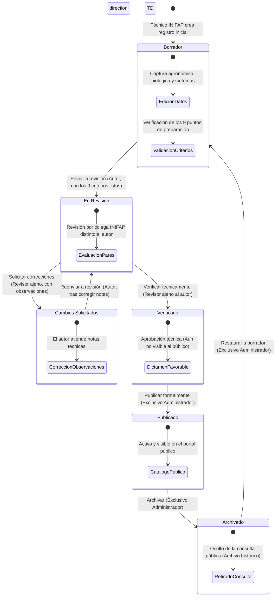

# Flujo de Aprobación y Publicación: Plagas

Este documento define el ciclo de vida editorial, reglas de control de acceso (RBAC), criterios de completitud (*readiness*) y transiciones de estado para el catálogo de plagas fitosanitarias en **Agrosystem**.

---

## 1. Principio de Segregación de Funciones (Four-Eyes / Revisión por Pares)

Para garantizar la rigurosidad científica y técnica de las fichas fitosanitarias, el sistema implementa una estricta separación de responsabilidades:

- **INIFAP (Autor):** Crea el borrador, captura la información agronómica/biológica, adjunta evidencia fotográfica y asocia cultivos hospederos y regiones. Envía a revisión cuando cumple el 100% de los criterios.
- **INIFAP (Revisor Técnico):** Un usuario con rol `inifap` **diferente del autor** (`userId !== createdByUserId`). Es el único facultado para evaluar la ficha, solicitar cambios o verificarla técnicamente. El autor **no** puede auditar ni verificar su propio trabajo.
- **Administrador:** Es el único rol facultado para la publicación definitiva en el catálogo público (`status = true`), así como archivar, restaurar o eliminar registros.

---

## 2. Diagrama de Estados y Flujo de Aprobación

---

## 3. Matriz de Transiciones y Permisos

| Estado Inicial | Acción (`action`) | Estado Resultante | Rol Permitido | Condición de Negocio |
| :--- | :--- | :--- | :--- | :--- |
| `draft` | `submit_review` | `in_review` | INIFAP / Admin | Debe ser el autor (`isAuthor`) y cumplir el 100% de *readiness*. |
| `in_review` | `request_changes` | `changes_requested` | INIFAP | Revisor técnico ajeno (`!isAuthor`). Observaciones obligatorias (máx. 500 caracteres). |
| `in_review` | `verify` | `verified` | INIFAP | Revisor técnico ajeno (`!isAuthor`). Registra `verified_by_user_id` y `verified_at`. |
| `changes_requested` | `submit_review` | `in_review` | INIFAP / Admin | Debe ser el autor. Limpia notas de revisión. |
| `verified` | `publish` | `published` | Admin | Solo Administrador. Registra `published_by_user_id`, `published_at` y activa `status = true`. |
| `published` | `archive` | `archived` | Admin | Solo Administrador. Desactiva visibilidad pública (`status = false`). |
| `archived` | `restore` | `draft` | Admin | Solo Administrador. Reinicia verificador y publicador para nuevo ciclo editorial. |

---

## 4. Requisitos de Preparación para Publicación (*Readiness Checklist*)

Antes de poder ejecutar `submit_review`, `verify` o `publish`, el servicio [`plagueReadinessService.js`](../../src/services/plagueReadinessService.js) valida de forma obligatoria los siguientes 9 criterios:

1. **Identificación taxonómica:** Nombre común y nombre científico (`name`, `scientific_name`).
2. **Clasificación y riesgo:** Categoría (`category`) y nivel de riesgo agronómico (`risk_level`).
3. **Descripción técnica:** Características morfológicas o biológicas detalladas (`description`).
4. **Síntomas observables:** Daños y signos visibles en la planta (`symptoms`).
5. **Estrategia de control:** Al menos un método de control cultural/químico o control biológico documentado (`control_methods` o `biological_control`).
6. **Ciclo biológico:** Al menos una etapa del ciclo de vida documentada en `biological_cycle` (huevo, larva, ninfa, adulto, etc.).
7. **Evidencia fotográfica:** Al menos una imagen de referencia cargada (`imageCount >= 1`).
8. **Cultivo hospedero:** Al menos un cultivo susceptible relacionado en la base de datos (`cropCount >= 1`).
9. **Región de incidencia:** Al menos una región geográfica asociada donde se presenta la plaga (`regionCount >= 1`).

---

## 5. Endpoints y Despacho Técnico

- **Transición de Workflow:**
  - `POST /private/plagues/:id/workflow`
  - Parámetros en Body: `{ "action": "submit_review" | "request_changes" | "verify" | "publish" | "archive" | "restore", "review_notes": "..." }`
- **Gestión de Relaciones (Cultivos / Regiones):**
  - `POST /private/plagues/:id/relations` (Solo editable en `draft` o `changes_requested`).
- **Respuesta ante infracción de permisos:**
  - `403 Forbidden` si un autor intenta verificarse a sí mismo o si un usuario no administrador intenta publicar.
  - `409 Conflict` si se intenta saltar una etapa no permitida (ej. de `draft` directo a `publish`).
