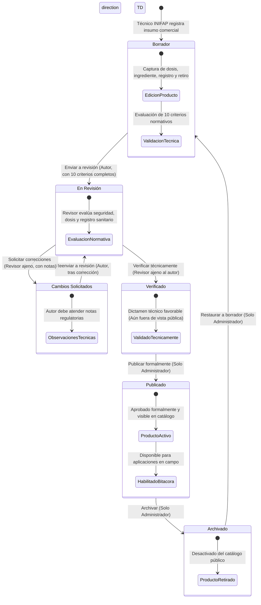

# Flujo de Aprobación y Publicación: Productos Agroquímicos

Este documento especifica el flujo técnico y regulatorio para la validación y publicación de productos comerciales, plaguicidas, fertilizantes y bioinsumos en **Agrosystem**.

---

## 1. Principio de Control de Calidad y Registro Oficial

Dado que los productos fitosanitarios conllevan implicaciones toxicológicas, normativas (COFEPRIS/SADER) y de seguridad alimentaria (periodos de retiro o intervalos de seguridad), su publicación exige estricto rigor:

- **INIFAP (Técnico Registrador / Autor):** Registra el producto, captura especificaciones comerciales, ingrediente activo, dosis, registro oficial y ficha técnica.
- **INIFAP (Comité Revisor / Colega):** Revisor con credenciales INIFAP distinto de quien lo dio de alta (`!isAuthor`). Corrobora que el ingrediente activo, formulación y dosis se apeguen a la norma y a las plagas objetivo.
- **Administrador:** Es la autoridad que emite el estado de `published` (Aprobado), permitiendo que el producto sea visible en el recetario público y habilitado para el registro de aplicaciones en parcelas (`FarmApplication`).

---

## 2. Diagrama de Estados del Producto

---

## 3. Matriz de Estados, Acciones y Campos

| Estado de Workflow | Acción (`action`) | Siguiente Estado | Estado de Validación (`validation_status`) | Visibilidad Pública (`status`) | Roles Permitidos |
| :--- | :--- | :--- | :--- | :---: | :--- |
| `draft` | `submit_review` | `in_review` | `En revisión` | `false` | INIFAP (Autor) |
| `in_review` | `request_changes` | `changes_requested` | `Cambios solicitados` | `false` | INIFAP (Revisor `!isAuthor`) |
| `in_review` | `verify` | `verified` | `Validado` | `false` | INIFAP (Revisor `!isAuthor`) |
| `changes_requested` | `submit_review` | `in_review` | `En revisión` | `false` | INIFAP (Autor) |
| `verified` | `publish` | `published` | `Aprobado` | `true` | Administrador |
| `published` | `archive` | `archived` | `Aprobado` | `false` | Administrador |
| `archived` | `restore` | `draft` | `En revisión` | `true` | Administrador |

---

## 4. Requisitos de Preparación Técnica (*Readiness Checklist*)

Definidos en [`productReadinessService.js`](../../src/services/productReadinessService.js). El producto debe cumplir los 10 campos requeridos sin excepción para enviarse a revisión o aprobarse:

1. **Identificación comercial:** Nombre comercial de la marca (`name`).
2. **Categoría:** Tipo de producto agronómico (`category`, ej. Fungicida, Insecticida, Herbicida, Bioestimulante).
3. **Ingrediente activo:** Sustancia o materia activa principal (`active_ingredient`).
4. **Registro oficial:** Código o registro sanitario expedido por la autoridad regulatoria (`registration_code`).
5. **Fabricante / Titular:** Casa comercial formuladora o distribuidor (`manufacturer`).
6. **Descripción técnica:** Composición, presentación y características fisicoquímicas (`description`).
7. **Modo de acción:** Mecanismo bioquímico o biológico de control (`mode_of_action`, ej. Sistémico, Contacto, Ingestion).
8. **Dosis sugerida:** Rango y unidades de dosificación por hectárea o volumen de caldo (`suggested_dosage`).
9. **Intervalo de seguridad:** Número de días enteros entre la última aplicación y la cosecha (`safety_interval_days`, valor de 0 a 3650 días).
10. **Evidencia fotográfica:** Imagen o fotografía del envase / etiqueta oficial (`imageCount >= 1`).

---

## 5. Endpoints y Despacho en Rutas Privadas

- **Control de Workflow:**
  - `POST /private/products/:id/workflow`
  - Parámetros: `{ "action": "submit_review" | "request_changes" | "verify" | "publish" | "archive" | "restore", "review_notes": "..." }`
- **Uso en Módulos Operativos:**
  - Solo los productos en estado `published` (`status = true` y `validation_status = 'Aprobado'`) están habilitados en los selectores de agroquímicos del módulo de bitácora y aplicaciones de campo (`POST /private/lands/:id/applications`).
