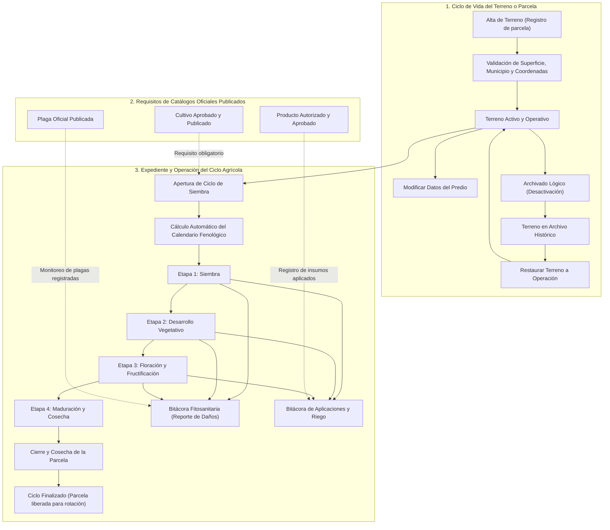

# Flujo de Gestión y Operación: Terrenos y Expediente Agrícola

Este documento define la arquitectura de permisos, validaciones, ciclo de vida y vinculación operativa del módulo de **Terrenos** (predios/parcelas) en **Agrosystem**.

---

## 1. Naturaleza y Propósito del Módulo de Terrenos

A diferencia de los catálogos técnicos (plagas, cultivos y productos) cuyo objetivo es la publicación editorial abierta, el módulo de **Terrenos** administra los expedientes privados de predios agrícolas, ciclos productivos, fenología y bitácoras de campo.

### Permisos y Control de Acceso (RBAC)

- **INIFAP (Técnico / Investigador Titular):**
  - Puede crear nuevos predios (`createFarmPrivate`).
  - Solo visualiza y gestiona sus propios terrenos asignados (`where: { user_id: req.user.id }`).
  - Puede editar datos del predio, archivar (`status = false`) o restaurar sus terrenos propios.
  - Administra el expediente operativo: apertura de ciclos, avance de fenología, reporte de plagas y registro de aplicaciones.
- **Administrador:**
  - Acceso total y supervisión global (`canViewAll = true`). Puede listar predios de todos los usuarios.
  - Puede intervenir excepcionalmente en cualquier terreno; cada mutación genera un evento en la tabla `AuditLog`.
- **Agricultor:**
  - Mantiene relación de propiedad (`user_id`). Su acceso directo al panel privado está reservado para la expansión de autoservicio bajo el resguardo de `requirePanelAccess`.

---

## 2. Diagrama de Flujo: Ciclo de Vida del Terreno y Expediente Operativo



---

## 3. Validaciones para el Alta y Modificación de Terrenos

Definidas en [`landValidationService.js`](../../src/services/landValidationService.js):

| Campo | Regla / Restricción | Mensaje de Error en Falla |
| :--- | :--- | :--- |
| `name` | Longitud entre 2 y 120 caracteres de texto normalizado. | *El nombre del terreno debe tener entre 2 y 120 caracteres.* |
| `size_hectares` | Numérico con hasta 2 decimales, entre 0.01 y 1,000,000 ha. | *La superficie debe estar entre 0.01 y 1,000,000 de hectáreas.* |
| `farming_type` | Debe coincidir con: `Temporal`, `Riego`, `Mixto`, `Tecnificado`, `Orgánico`, `Hidroponía`. | *Selecciona un tipo de agricultura válido.* |
| `municipality` | Texto libre de máximo 100 caracteres. | *El municipio no puede exceder 100 caracteres.* |
| `region_id` | Llave foránea válida y existente en la tabla `Regions`. | *La región seleccionada no existe.* |
| `location_lat` / `lng` | Coordenadas decimales opcionales validadas en rango geográfico nacional. | *Coordenadas geográficas inválidas.* |

---

## 4. Reglas de Negocio en la Operación de Expedientes

Definidas en [`landCycleController.js`](../../src/controllers/private/lands/landCycleController.js) y [`landPhenologyService.js`](../../src/services/landPhenologyService.js):

### A. Apertura de Ciclo (`POST /private/lands/:id/cycles`)
1. Solo se permite abrir ciclos en predios activos (`status = true`).
2. **Validación cruzada de catálogo:** La consulta exige:
   ```javascript
   where: {
     id: crop_id,
     workflow_status: 'published'
   }
   ```
   Si el cultivo está en borrador o revisión, la creación del ciclo es rechazada inmediatamente.
3. **Cálculo fenológico automático:** A partir de la fecha de siembra (`planting_date`) y los días estimados de cosecha (`harvest_days` del cultivo), el sistema calcula y crea los registros de `FarmCropStage` (etapas fenológicas proyectadas).

### B. Avance y Monitoreo de Etapas (`POST /private/lands/:id/cycles/advance`)
1. Las etapas fenológicas se completan secuencialmente.
2. Cada avance registra fecha de cumplimiento y observaciones de campo.

### C. Incidencias Fitosanitarias y Aplicaciones
- **Reporte de Salud (`POST /private/lands/:id/health-reports`):** Permite reportar la presencia o severidad de una plaga (`plague_id`), vinculada al catálogo oficial.
- **Aplicaciones de Insumos (`POST /private/lands/:id/applications`):** Permite asentar fecha, dosis y método de aspersión empleando productos verificados y aprobados (`product_id`).

### D. Finalización de Ciclo (`POST /private/lands/:id/cycles/finish`)
- Pasa `is_active = false` y `status = 'completed'` en `FarmCrop`, dejando la parcela lista para la rotación de cultivo.

---

## 5. Auditoría y Trazabilidad

Cualquier cambio de estado en el predio o en su expediente genera una entrada inmutable en `AuditLogs`:
- Acción ejecutada (`create`, `update`, `archive`, `restore`, `create_crop_cycle`, `advance_crop_stage`, `create_application`).
- `table_name`: `Farms` o `FarmCrops`.
- `old_values` y `new_values` en formato JSON.
- `user_id`: Identificador del usuario autenticado que autorizó la acción.
